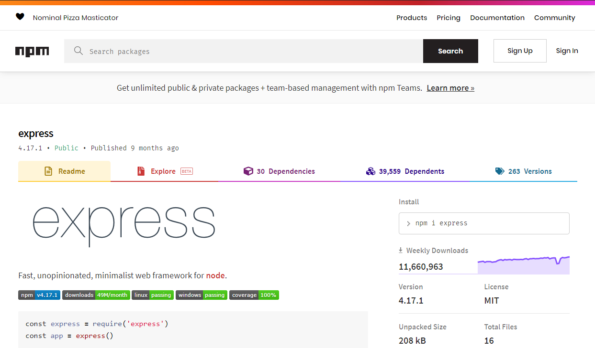

# Express

---



---

## What is Express?

- One of the most important node modules.
- It removes **_a lot_** of the complexity around creating and maintaining a server.
- It allows us to create and maintain a server in JS through NodeJS.

---

### Example server

This will give us a barebones server that we can `GET` content.

```js
// Import the express module
const express = require("express");

// Create an Express application
const app = express();

// Allows for parsing of JSON data in requests
// Stores the data in the body
app.use(express.json());

// Create an endpoint with method GET
app.get("/hello", (req, res) => {
    res.status(200).json({status: 200, message: "Hello", data: data})
});

// Launches the server on port 8000
app.listen(8000);
```

---

## HTTP request methods

- HTTP defines a set of request methods (`fetch` methods).
- `GET` is one such method.
- It is used to request a resource "representation".
- Requests using `GET` should only retrieve data.

---

When you type a url in the browser, or click a link on a webpage, you are making...

**...a `GET` request to a server somewhere. You are _requesting_ content from an endpoint.**

---

## Endpoints

```js
app.get("/hello", (req, res) => {
    res.status(200).json({status: 200, message: "Hello", data: data})
});
```

An endpoint is made up of 4 things:
1. A method (`.get`).
2. A URL (`"/hello"`).
3. A callback function (`(req, res) => {...}`).
4. A response (`res.status(200).json({...})`).

---

## 1. The Method

The method of the endpoint determines what method the `fetch` request will need in order to reach the server.

`app.get` ensures only a `fetch` with a method `GET` will reach that endpoint.

`app.post` ensures only a `fetch` with a method `POST` will reach that endpoint.

---

## 2. The URL

The URL is the address where the server can be contacted.

It works similar to the FE: when you navigate to a new URL, a different page is loaded.

For servers, when you ping a new URL, different data is returned.

---

## 3. The Callback Function

The callback function is executed when an endpoint is pinged, and takes in 2 **required** parameters:
- The request object (`req`): the request of the front-end / user.
- The response object (`res`): the response of the server.

---

## 4. The Response

A NodeJS server can only send **_one response per endpoint_**!

Our responses will always take the following form:

```js
res.status(200).json({status: 200, message: /*<MESSAGE HERE>*/, data: /*<DATA HERE>*/});
```

Why are we setting the status twice, you might be wondering?
- `res.status(200)` is the response code of the server. It's what will display in the logs of the server and the browser.
- `{status: 200}` is the status of the response inside the `JSON` object so the FE dev can make use of it, if they need it.